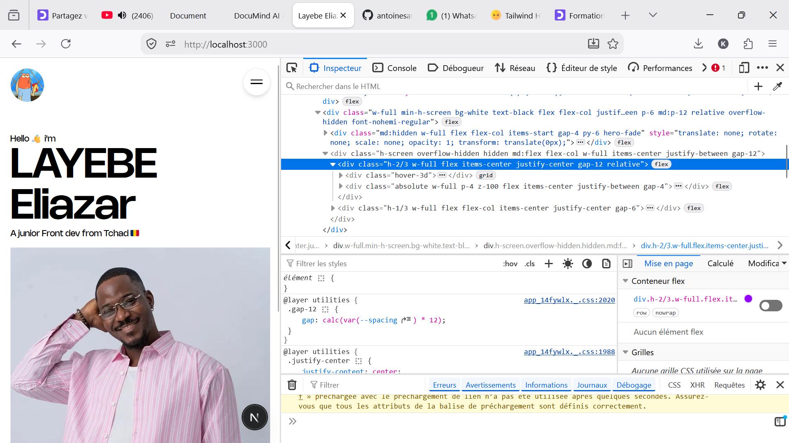
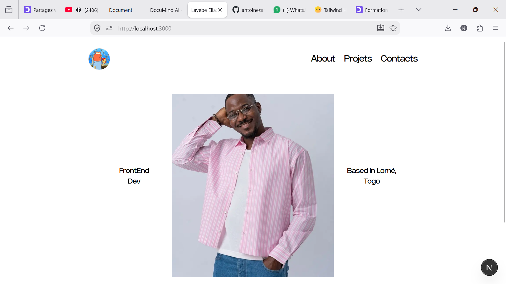

# 📘 eliazarPortfolio

> A Minimalist Porfolio for **@eliazard**.

[](https://github.com/antoinesamuel/eliazarPortfolio)
[](https://github.com/antoinesamuel/eliazarPortfolio)
[](https://documind-ai.com)

---

## 🚀 Vue d'ensemble du Projet

**eliazarPortfolio** est un dépôt GitHub maintenu par **@antoinesamuel**. Cette documentation a été générée automatiquement par l'IA de **DocuMind AI** en analysant l'arborescence et la structure logicielle du dépôt.

#Lien du depot de **DocuMind AI**
https://github.com/Godwin-dot/Documind-ai

### 📊 Statistiques du dépôt

- **Langages principaux:** TypeScript (96%), JavaScript (1.9%), CSS (1.6%)
- **Fichiers détectés:** 28 fichiers dans 8 dossiers
- **Branche principale:** `main`
- **Étoiles GitHub:** ⭐ 4 820
- **Forks:** 🔀 610

---

## 🛠️ Architecture & Structure du Code

Voici l'arborescence clé identifiée au sein du projet :

```bash
eliazarPortfolio/
├── 📁 src/                 # Code source principal de l'application
│   ├── 📁 components/     # Composants UI réutilisables
│   ├── 📁 hooks/          # Custom React Hooks & State management
│   └── 📁 lib/            # Modules utilitaires et API client
├── 📁 public/              # Assets statiques (images, favicons, fonts)
├── 📄 package.json         # Dépendances & scripts de configuration
└── 📄 README.md            # Documentation générée
```

---

## ⚡ Installation & Démarrage Rapide

### 1. Prérequis

- **Node.js** `>= 18.0.0` (ou runtime adapté au projet)
- **Git** installé sur votre machine
- Gestionnaire de paquets (`npm`, `yarn` ou `pnpm`)

### 2. Cloner le dépôt

```bash
git clone https://github.com/antoinesamuel/eliazarPortfolio.git
cd eliazarPortfolio
```

### 3. Installer les dépendances

```bash
npm install
```

### 4. Lancer l'environnement de développement

```bash
npm run dev


<!-- Image stockée localement dans votre projet -->

#Version Mobile

#Version Desktop


_Documentation générée en 1.8s avec ⚡ DocuMind AI Engine_
```
